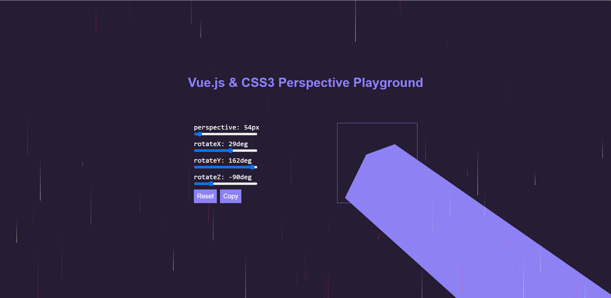

# vuejs-css3-perspectice-playground
I'm just trying something with Vue.js

# How i will run it?
<ul>
  <li>First, downlaod the project.</li>
  <li>Then you just have to open the "index.html" file in the browser.</li>
</ul>

# So, how does it look?

